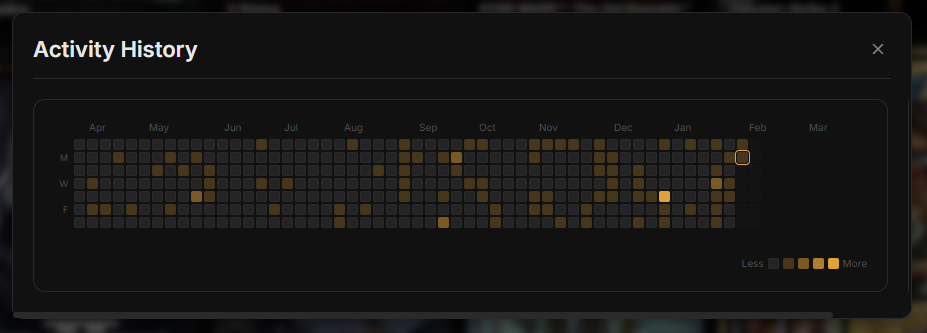

# KIOKU

> **Know where your hours go.** KIOKU automatically monitors which applications you use and for how long — no manual timers, no input required.


---

## What It Does

KIOKU runs quietly in your system tray and tracks focused application you use.

- **Active time** — the app has your focus (window in foreground)

All data is stored locally in a SQLite database. Nothing is sent to any server.

## Features

- **Automatic tracking** — polls every 5 seconds with no user input required
- **Dashboard** — view daily, weekly, monthly, or custom time range summaries with bar charts
- **Gallery** — browse all tracked apps and groups, edit metadata, set custom icons
- **App groups** — organize apps into categories (Browsers, Games, Dev Tools, etc.) with pattern-based auto-grouping
- **Blacklist / Whitelist modes** — track everything by default, or only what you explicitly allow
- **Steam import** — pull your Steam game library in one click
- **Data export & import** — full JSON backup and restore
- **Auto-updates** — checks for new releases on launch via GitHub

## Screenshots

**Gallery** — every tracked app and game shown as a card with cover art. From here you can rename entries, assign custom artwork, and organize apps into groups.


**Dashboard heatmap** — a calendar-style heatmap showing daily usage intensity over time, part of the main Dashboard view.



---

## Installation

Download the latest installer from the [Releases](https://github.com/ItsAshn/Kioku/releases) page and run the `.exe`.

The app installs per-user (no admin required) and starts tracking immediately. It lives in your system tray.

**Data location**: `%APPDATA%\KIOKU\`

### Windows SmartScreen Warning

Because the installer is currently unsigned, Windows SmartScreen may show a *"Windows protected your PC"* dialog. This is expected. To proceed:

1. Click **More info**
2. Click **Run anyway**

The application is safe. This warning appears for any installer without a paid code-signing certificate.

### Linux

**Arch Linux:**
```bash
sudo pacman -U kioku-0.10.2.pacman
```

**Other:** Use AppImage, .deb, or extract tar.gz. See [Releases](https://github.com/ItsAshn/Kioku/releases).

**Data location:** `~/.config/KIOKU/`

---

## Development

### Prerequisites

- Node.js 20+
- npm

### Setup

```bash
git clone https://github.com/ItsAshn/Kioku.git
cd Kioku
npm install
```

### Run in Development

```bash
npm run dev
```

Starts Electron with hot reload for the renderer process.

### Build

```bash
npm run build      # Build JS/CSS bundles only
npm run package    # Build + create Windows NSIS installer
```

## Privacy

KIOKU reads the names and executable paths of running processes, and the title of your active window, every 5 seconds. This data is used solely to build your local usage history.

- **All data is stored locally** in `%APPDATA%\KIOKU\data.db` (Windows) or `~/.config/KIOKU/data.db` (Linux).
- **No data is transmitted** to any external server except automatic update checks against GitHub Releases.
- The app does **not** record keystrokes, clipboard content, screenshots, or any other personal data.

---

## License

Copyright (c) 2025 ItsAshn. All Rights Reserved.

This software is proprietary. See [THIRD_PARTY_NOTICES.md](THIRD_PARTY_NOTICES.md) for third-party open-source component licenses.
